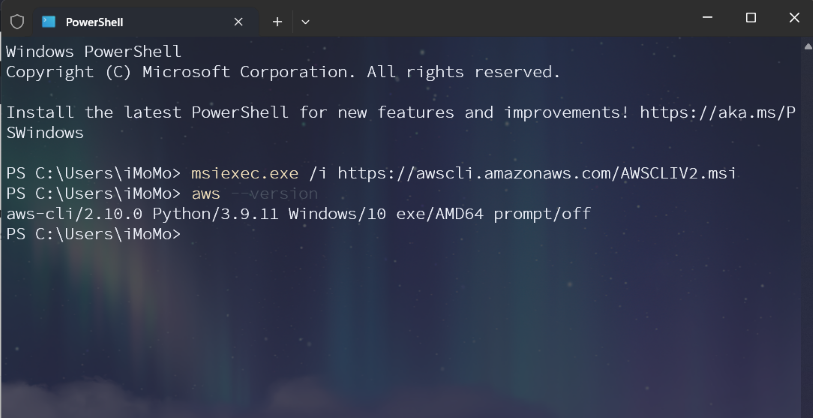
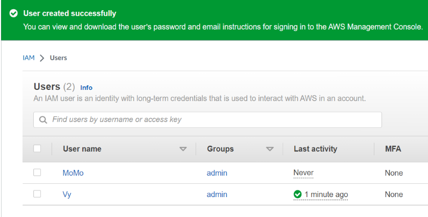
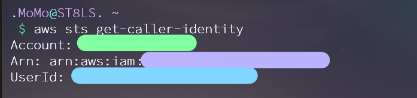
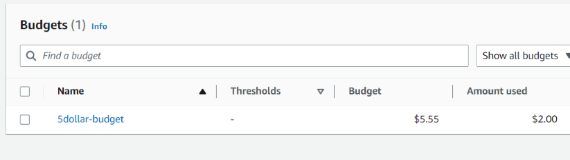
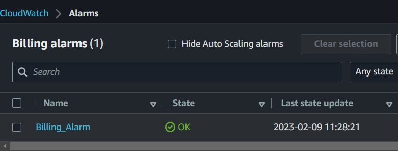
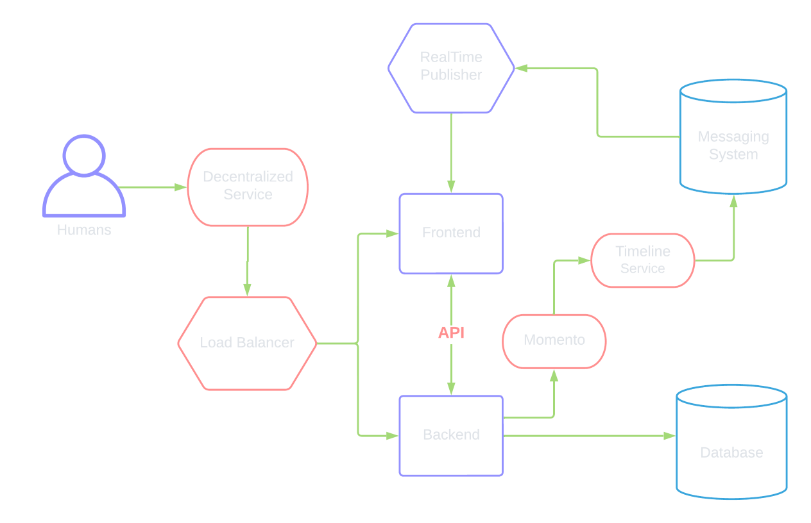
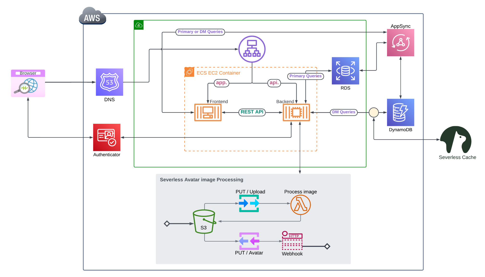
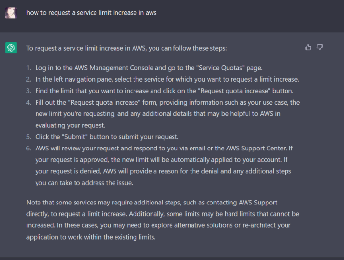
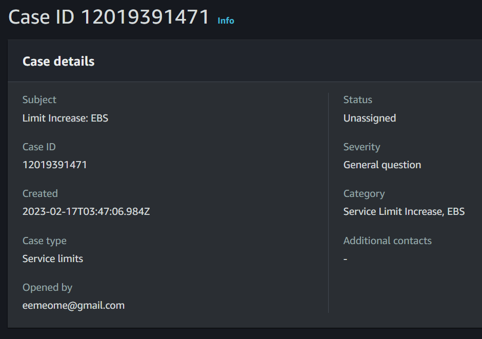

# 📝 **Week 0 — Billing and Architecture**

## **Required Tasks**

### ✅ Install AWS CLI

- _Since AWS CLI was already installed I used the following command to update to the latest version via Powershell_

  ```yml
  msiexec.exe /i https://awscli.amazonaws.com/AWSCLIV2.msi
  ```

- _Ran into error with installer because my Nvidia Overlay was on❗In order to continue with installer I manually close Nvidia Containers in Windows Task Managers_

- _Problem solved ✔_

- _To verify CLI has been updated_

  ```yml
  aws --version
  ```

  

⮜⬩ 🞘 🞗 ⬩ 🞘 🞗 ⬩ 🞘 🞗 ⬩ 🞘 🞗 ⬩ 🞘 🞗 ⯌ 🞗 🞘 ⬩ 🞗 🞘 ⬩ 🞗 🞘 ⬩ 🞗 🞘 ⬩ 🞗 🞘 ⬩⮞

### ✅ Create Admin user

- _Created new user added to group with ***AdministratorAccess***_

  

⮜⬩ 🞘 🞗 ⬩ 🞘 🞗 ⬩ 🞘 🞗 ⬩ 🞘 🞗 ⬩ 🞘 🞗 ⯌ 🞗 🞘 ⬩ 🞗 🞘 ⬩ 🞗 🞘 ⬩ 🞗 🞘 ⬩ 🞗 🞘 ⬩⮞

### ✅ Generated AWS Credentials

- _Generated credentials via bash_

  ```yml
  aws sts get-caller-identity
  ```

  

⮜⬩ 🞘 🞗 ⬩ 🞘 🞗 ⬩ 🞘 🞗 ⬩ 🞘 🞗 ⬩ 🞘 🞗 ⯌ 🞗 🞘 ⬩ 🞗 🞘 ⬩ 🞗 🞘 ⬩ 🞗 🞘 ⬩ 🞗 🞘 ⬩⮞

### ✅ Budget & Billing Alarm

- _Decided to create a $5 budget instead because 5 is my favorite number_

  

- _Billing alarm already created prior_

  

⮜⬩ 🞘 🞗 ⬩ 🞘 🞗 ⬩ 🞘 🞗 ⬩ 🞘 🞗 ⬩ 🞘 🞗 ⯌ 🞗 🞘 ⬩ 🞗 🞘 ⬩ 🞗 🞘 ⬩ 🞗 🞘 ⬩ 🞗 🞘 ⬩⮞

### ✅ Recreated Conceptual Diagram

- _I sprinkled some glitter on the conceptual diagram we did in live session_

- _Click image for full size chart_

  [](https://lucid.app/lucidchart/954486e7-37fe-42e1-b36c-396429e373b3/edit?viewport_loc=-213%2C-446%2C2394%2C1585%2C0_0&invitationId=inv_c3e6b972-6424-4e6b-a446-96fd68152c60)

⮜⬩ 🞘 🞗 ⬩ 🞘 🞗 ⬩ 🞘 🞗 ⬩ 🞘 🞗 ⬩ 🞘 🞗 ⯌ 🞗 🞘 ⬩ 🞗 🞘 ⬩ 🞗 🞘 ⬩ 🞗 🞘 ⬩ 🞗 🞘 ⬩⮞

### ✅ Recreated Logical Architecture Diagram

- _Click image for full size chart_

  [](https://lucid.app/lucidchart/b57a32f7-a918-4f8f-9c30-182bbfc4b9bc/edit?viewport_loc=-20%2C-206%2C3090%2C2046%2C0_0&invitationId=inv_55974d3b-a3b4-4e91-a720-0a81a38e7572)

⮜⬩ 🞘 🞗 ⬩ 🞘 🞗 ⬩ 🞘 🞗 ⬩ 🞘 🞗 ⬩ 🞘 🞗 ⯌ 🞗 🞘 ⬩ 🞗 🞘 ⬩ 🞗 🞘 ⬩ 🞗 🞘 ⬩ 🞗 🞘 ⬩⮞

## **Challenges** ✨

### ✅ Support Ticket for Service Limits

- _To create a support ticket for service limit increase I utilized OpenAI latest chatbot_

- Open [ChatGPT](https://chat.openai.com/chat)
- Enter "how to request service limit increase in aws"
- AI provided instruction
- Go back to aws console and followed instructions to create a request

  

  

⮜⬩ 🞘 🞗 ⬩ 🞘 🞗 ⬩ 🞘 🞗 ⬩ 🞘 🞗 ⬩ 🞘 🞗 ⯌ 🞗 🞘 ⬩ 🞗 🞘 ⬩ 🞗 🞘 ⬩ 🞗 🞘 ⬩ 🞗 🞘 ⬩⮞
